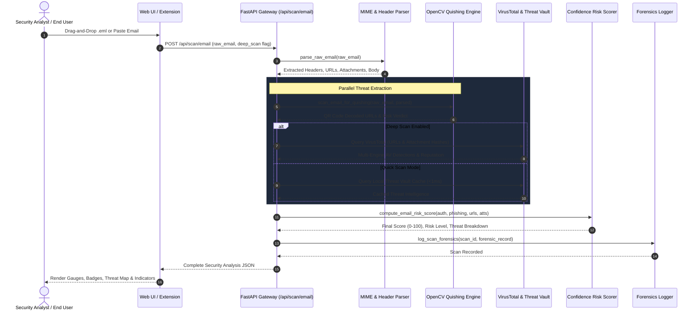

# SecureMail Data Flows & Execution Sequences 🔄

## 1. Email Ingestion & Processing Pipeline

```mermaid
sequenceDiagram
    autonumber
    actor User as Security Analyst / End User
    participant Frontend as Web UI / Extension
    participant API as FastAPI Gateway (/api/scan/email)
    participant Parser as MIME & Header Parser
    participant Vision as OpenCV Quishing Engine
    participant Threat as VirusTotal & Threat Vault
    participant Scorer as Confidence Risk Scorer
    participant Vault as Forensics Logger

    User->>Frontend: Drag-and-Drop .eml or Paste Email
    Frontend->>API: POST /api/scan/email (raw_email, deep_scan flag)
    API->>Parser: parse_raw_email(raw_email)
    Parser-->>API: Extracted Headers, URLs, Attachments, Body
    
    rect rgb(30, 41, 59)
        Note over API,Vision: Parallel Threat Extraction
        API->>Vision: scan_email_for_quishing(raw_email, parsed)
        Vision-->>API: QR Code Decoded URLs & Risk Verdict
        
        alt Deep Scan Enabled
            API->>Threat: Query VirusTotal (URLs & Attachment Hashes)
            Threat-->>API: Multi-Engine AV Detections & Reputation
        else Quick Scan Mode
            API->>Threat: Query Local Threat Vault Cache (<1ms)
            Threat-->>API: Cached Threat Intelligence
        end
    end

    API->>Scorer: compute_email_risk_score(auth, phishing, urls, atts)
    Scorer-->>API: Final Score (0-100), Risk Level, Threat Breakdown
    API->>Vault: log_scan_forensics(scan_id, forensic_record)
    Vault-->>API: Scan Recorded
    API-->>Frontend: Complete Security Analysis JSON
    Frontend-->>User: Render Gauges, Badges, Threat Map & Indicators
```
