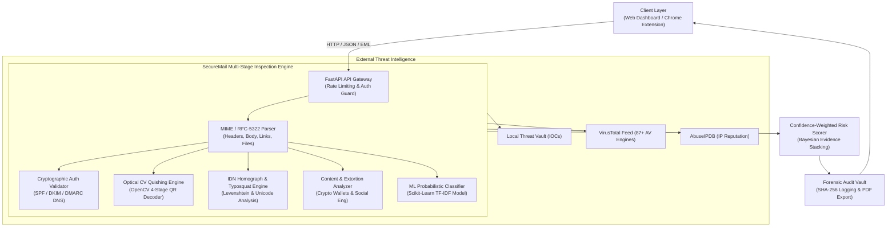

# SecureMail System Architecture 🏛️

## 1. High-Level Architecture Overview

SecureMail is a multi-tier, defense-in-depth email security platform designed to detect advanced threats across three distinct vectors:
1. **Network & Identity Spoofing** (SPF, DKIM, DMARC, IDN homoglyphs, typosquatting).
2. **Optical & Steganographic Threats** (Quishing — QR code phishing hidden in inline CID images, base64 payloads, and attachments).
3. **Payload & Malicious Content** (Executable files, dangerous macro formats, Bitcoin extortion, multi-engine VirusTotal consensus).



---

## 2. Component Directory Architecture

```
SecureMail/
├── Architecture/                      # Architecture, threat model & API specifications
│   ├── SYSTEM_ARCHITECTURE.md         # End-to-end multi-tier system architecture (this document)
│   ├── THREAT_MODELING.md             # Threat vectors, MITRE ATT&CK mapping & scoring logic
│   ├── DATA_FLOWS.md                  # Lifecycle sequence diagrams from ingestion to verdict
│   └── API_REFERENCE.md               # Complete REST API specifications & schemas
├── Backend/                           # FastAPI Cyber-Defense Engine
│   ├── app/                           # Core application package
│   │   ├── routers/                   # API endpoint controllers
│   │   ├── services/                  # Business logic & threat engines
│   │   ├── models/                    # Pydantic schemas
│   │   └── utils/                     # Logging & helpers
│   ├── tests/                         # Full automated regression test suite (128 tests)
│   └── run_server.py                  # API server startup script
├── Frontend/                          # Cyber Defense Web Interface
│   ├── index.html                     # Clean, semantic modular HTML
│   ├── index.standalone.html          # All-in-one standalone build
│   ├── css/style.css                  # Human-readable & editable stylesheet
│   ├── js/auth.js                     # Firebase authentication & session module
│   ├── js/app.js                      # Application controller, charts & scanner UI
│   └── assets/                        # Brand logos and icons
├── Extension/                         # Chrome / Edge / Brave Extension
│   ├── manifest.json                  # Manifest V3 extension configuration
│   ├── background.js                  # Service worker & API cache
│   ├── content.js                     # In-page Gmail & Outlook DOM inspector
│   └── popup.html / popup.js          # Toolbar scanner interface
├── Test_Suite/                        # Malicious Email & Threat Sample Suite
│   ├── 01_credential_phishing.eml     # Typo-squatting credential theft sample
│   ├── 02_eicar_malware_attachment.eml# Safe EICAR antivirus test file attachment
│   ├── 03_quishing_qr_code.eml        # Optical QR code phishing email
│   ├── 04_extortion_blackmail_btc.eml # Sextortion & Bitcoin ransom demand
│   ├── 05_ceo_impersonation_bec.eml   # Business Email Compromise & CEO spoofing
│   ├── 06_macro_malware_docm.eml      # Macro-enabled Office document attack
│   ├── 07_clean_legitimate_newsletter.eml # Control baseline (clean verified email)
│   ├── attachments/                   # Mock attachments (EICAR, macro docs, QR)
│   └── run_tests.py                   # Automated sample verification runner
└── Scripts/                           # Convenience Windows launch scripts
    ├── start_backend.bat              # One-click Backend launch
    ├── start_frontend.bat             # One-click Frontend launch
    └── run_all_tests.py               # Unified test runner
```
